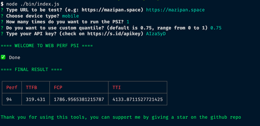

# 🚀 webperf-psi

Easy to use, PSI API hit using Node.js to collect Web Performance Metrics



## Get your own API Key

Visit [https://developers.google.com/speed/docs/insights/v5/get-started](https://developers.google.com/speed/docs/insights/v5/get-started)

## Usage

- **With `npx`, using interactive mode**

```bash
$ npx webperf-psi
```

- **With `npx`, using CLI mode**

```bash
$ npx -p webperf-psi webperf-psi-cli --u={YOUR_PAGE} --k={API_KEY}
```

Available arguments:

| Args  | Desc 						   | Required  | Default Value  |
|-------|--------------------|-----------|----------------|
| `u`   | Url to be tested   |  yes 		 | -  						|
| `k`   | API Key  					 |  yes 		 | -  						|
| `d`   | Device  					 |  no 		 	 | mobile  				|
| `h`   | Number of hit PSI  |  no 			 | 1  						|
| `q`   | Quantile  				 |  no 			 | 0.75  					|

- **Run in your local**

Fork, then just run:

```bash
$ pnpm install
$ pnpm run psi
```

## Support

You can support me by just giving a ⭐ in this repository

---

© 2020 Crafted by Irfan Maulana
